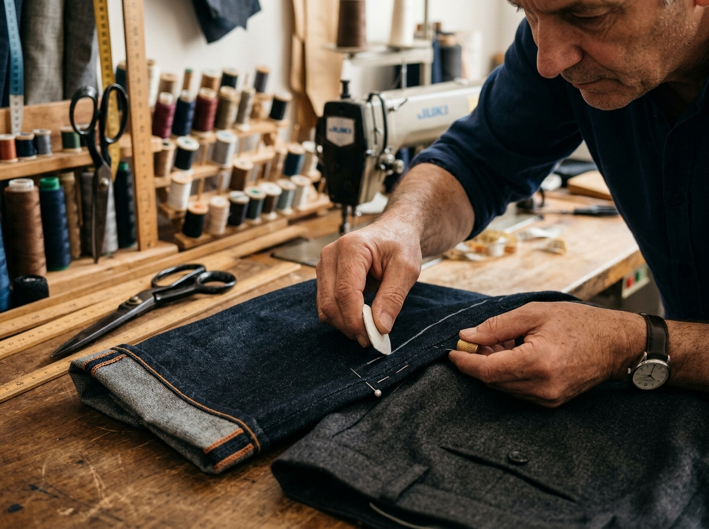

# 🧵 Ramadic Entre Linhas — Ateliê de Costura & Alfaiataria

> Sistema completo de gestão e landing page interativa para ateliê de costura, ajustes finos de alfaiataria, vestidos de festa e reparos têxteis.



---

## 🚀 Funcionalidades

- **Simulador Interativo de Valores e Prazos**: Cálculo dinâmico para barras, ajustes de cós, mangas, vestidos de festa e paletós.
- **Rastreamento de Ordem de Serviço (OS)**: Consulta em tempo real do status e etapas de produção de cada peça.
- **Ficha Técnica Operacional**: Registro minucioso de tipo de tecido, cor da linha/pesponto original, altura de barra (cm), ajustes de cintura (cm) e avarias prévias na entrada.
- **Controle Financeiro**: Gestão de sinal de entrada no balcão e saldo na retirada (PIX, Cartão, Dinheiro).
- **Banco de Dados PostgreSQL no Neon**: Modelagem multi-tenant completa com Row Level Security (RLS) habilitado.

---

## 🛠️ Tecnologias Utilizadas

- **Frontend**: React 19, Vite, Tailwind CSS, Lucide React
- **Banco de Dados**: PostgreSQL no Neon (`sa-east-1`)
- **Segurança**: Row Level Security (RLS) & Políticas Multi-tenant
- **Fontes**: Google Fonts (Plus Jakarta Sans)

---

## 📦 Como Executar o Projeto Localmente

1. **Clonar o Repositório**:
   ```bash
   git clone https://github.com/SEU_USUARIO/ramadic-atelie.git
   cd ramadic-atelie
   ```

2. **Instalar Dependências**:
   ```bash
   npm install
   ```

3. **Configurar Variáveis de Ambiente**:
   ```bash
   cp .env.example .env
   ```

4. **Executar em Modo de Desenvolvimento**:
   ```bash
   npm run dev
   ```
   Acesse: `http://localhost:5173/`

5. **Gerar Build de Produção**:
   ```bash
   npm run build
   ```

---

## 🗄️ Estrutura do Banco de Dados (Neon / PostgreSQL)

- `alfaiataria`: Dados do ateliê (tenancy).
- `profissionais`: Costureiros(as), atendentes e comissões.
- `clientes`: Contatos, WhatsApp e histórico.
- `servicos_catalogo`: Tabela de serviços e preços base.
- `ordens_servico`: Ordens de serviço e controle financeiro.
- `itens_os`: Ficha técnica de cada peça e medidas em centímetros.
- `fotos_os`: Fotos da prova com marcação em giz e alfinete.
- `pagamentos_os`: Sinais e saldos de retirada.
- `historico_status_os`: Linha do tempo de produção.

---

## 📄 Licença

Este projeto é de propriedade de **Ramadic Entre Linhas - Ateliê de Costura**. Todos os direitos reservados.
